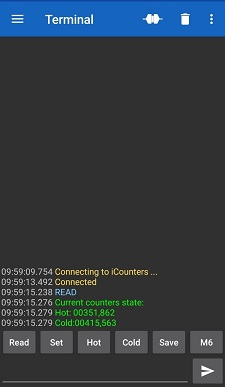
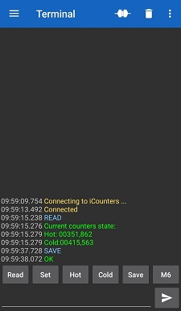
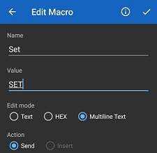

# water_counter
Water counter based on Arduino and HC-05 bluetooth module

Счетчик воды на Arduino и bluetooth модуле HC-05

## Описание
За основу взят [проект](https://pikabu.ru/story/podklyuchaem_arduino_k_schetchikam_vodyi_4258720) уважаемого **ansealk**.

- **Убран** ЖК-дисплей с I2C-модулем, RTC модуль.
- **Добавлен** HC-05 bluetooth модуль для удаленного снятия показаний (телефон, компьютер, роутер), модуль зарядки и переключения для автономного питания, команды управления.
- **Добавлены** модули *Wemos Battery Shield V1.2.0 UPS 5V* и половинка *Контроллера заряда Li-ion аккумуляторов 03962A TP4056 Micro USB* для предотвращения разряда аккумулятора ниже 2.7В по рекомендации [RBsonic](https://www.youtube.com/watch?v=b-fWiX_TzrE). При необходимости [заменить резисторы R3,R4](https://youtu.be/b-fWiX_TzrE?t=95) на *Wemos Battery Shield* для регулировки тока заряда аккумулятора.

## Схема

- [ ] Она здесь обязательно будет.

## Команды терминала

- ***READ*** - Чтение текущих показаний.
- ***SET*** - Установка показаний
    - ***H:*** - счетчика горячей воды (*SET H:00000,000*)
    - ***C:*** - счетчика холодной воды (*SET C:00000,000*)
- ***SAVE*** - Сохранение текущих показаний в EEPROM (например, для отключения устройства при длительном отсутствии).

Я использую [Serial Bluetooth Terminal](https://play.google.com/store/apps/details?id=de.kai_morich.serial_bluetooth_terminal&hl=ru&gl=US) для чтения и изменения показаний счетчиков.

  

В программе можно назначить макросы для быстрого доступа к командам.  
      

## Файлы

[*water_counter.ino*](https://github.com/nmare99/water_counter/blob/main/water_counter.ino) - скетч arduino 

[*get_count.sh*](https://github.com/nmare99/water_counter/blob/main/get_count.sh) - пример shell скрипта для получения данных о счетчиках в файл

